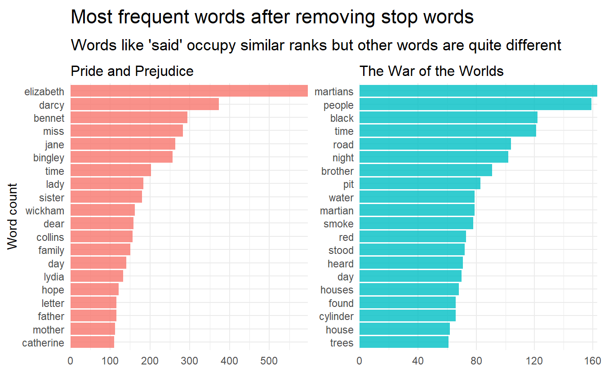

# Text classification

https://juliasilge.com/blog/tidy-text-classification/


```r
library(tidymodels)
library(gutenbergr)

titles <- c(
  "The War of the Worlds",
  "Pride and Prejudice"
)

books <- gutenberg_works() %>% 
  filter(title %in% titles) %>% 
  gutenberg_download(meta_fields = "title") %>% 
  mutate(document = row_number())
```


```r
tidy_books <- books %>%
  unnest_tokens(word, text) %>%
  anti_join(stop_words) %>% 
  group_by(word) %>%
  filter(n() > 10) %>%
  ungroup()
```


```r
tidy_books %>%
  count(title, word, sort = TRUE) %>% 
  group_by(title) %>% 
  top_n(20) %>%
  facet_bar(y = word, x = n, by = title) + 
  labs(
    x = NULL, y = "Word count",
    title = "Most frequent words after removing stop words",
    subtitle = "Words like 'said' occupy similar ranks but other words are quite different"
  )
```



